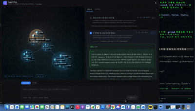

# Tikitaka — 멀티 에이전트 토론 시각화

에이전트 팀(스쿼드)이 하나의 질문을 두고 토론하는 과정을, **원자 모형**으로 실시간
시각화하는 프론트엔드.

질문 하나가 원자 하나가 되고, 참여한 에이전트가 그 주위 궤도에 놓이며,
주고받은 발언이 에너지선으로 흐른다. 후속 질문을 하면 원자가 하나 더 생겨 결합하므로
**대화 전체가 하나의 분자**가 된다.



```
https://tikitaka-fe.vercel.app
```

- `main` — 실제 프론트엔드 (배포 대상)
- `mockup` — 작업 브랜치. main으로 머지된다

---

## 목차

1. [빠르게 실행](#빠르게-실행)
2. [프로젝트 구조](#프로젝트-구조)
3. [아키텍처 — 단방향 데이터 흐름](#아키텍처--단방향-데이터-흐름)
4. [에이전트 모델](#에이전트-모델)
5. [폴링 구조](#폴링-구조)
6. [백엔드 연동](#백엔드-연동)
7. [대화 모델 — 턴, 후속 질문, 저장](#대화-모델--턴-후속-질문-저장)
8. [화면](#화면)
9. [왜 3D 원자인가](#왜-3d-원자인가)
10. [배포](#배포)

---

## 빠르게 실행

```bash
npm install
npm run dev        # http://localhost:5173
npm run build      # tsc -b && vite build → dist/
npm run lint       # oxlint
```

**백엔드 없이도 돌아간다.** 환경변수가 비어 있으면 입력한 프롬프트에서 실행 시나리오를
생성해 실시간 스트림처럼 재생한다(mock 모드). 실제 백엔드에 붙이려면 `.env`:

```bash
VITE_API_URL=/backend                                  # 앱이 부르는 경로 (상대 경로)
VITE_BACKEND_ORIGIN=https://xxxx.ngrok-free.app        # 프록시가 넘길 실제 주소
```

앱은 절대 주소가 아니라 `/backend` 같은 상대 경로를 부른다. 백엔드에 CORS가 없어서
브라우저가 직접 못 부르기 때문이다 — 개발은 `vite.config.ts`, 배포는 `vercel.json`의
rewrites가 대신 넘겨준다. 자세한 것은 [백엔드 연동](#백엔드-연동).

**스택** — React 19 · TypeScript · Vite 6 · zustand · three.js(@react-three/fiber, drei,
postprocessing) · @xyflow/react + elkjs(현재 미사용, 아래 참고)

---

## 프로젝트 구조

```
src/
├─ entities/              도메인. React도 three도 모른다
│  ├─ event.ts              백엔드와의 유일한 계약 (이벤트 스키마)
│  ├─ run.ts                실행 상태 타입 (AgentState / MessageLink / RunState)
│  └─ reduce.ts             이벤트 → 상태. 순수 리듀서
│
├─ transport/             이벤트 공급자. 앱 전체에서 유일한 교체 지점
│  ├─ index.ts              createRun / createDriver — mock ↔ 실제 백엔드 분기
│  ├─ types.ts              RunDriver 인터페이스 (start / stop)
│  ├─ discussionDriver.ts   실제 백엔드. 폴링을 스트림처럼 바꾼다
│  ├─ discussion.ts         Discussion API 응답 → 이벤트 어댑터
│  ├─ summarize.ts          제목·결론 LLM 요약
│  ├─ scenario.ts           mock — 프롬프트에서 시나리오 생성
│  └─ mockDriver.ts         mock — 시나리오를 타임스탬프대로 재생
│
├─ stores/
│  ├─ runStore.ts           대화(턴 목록) · 드라이버 수명 · localStorage 지속
│  └─ viewStore.ts          선택, 패널 상태/너비, 원자 위치 오버라이드
│
└─ features/
   ├─ landing/               첫 화면 — Tikitaka + START, 원자 하나가 퍼지며 진입
   ├─ graph3d/               3D 본체
   │   ├─ atom.ts              원자 모형·측지선 구·턴 트리 배치 (순수 수학)
   │   ├─ AtomScene.tsx        three.js 렌더링
   │   └─ Flow3D.tsx           lazy 경계 (three는 무겁다)
   ├─ panel/                 우측 사이드바 셸 (결과 ↔ 에이전트 탭)
   ├─ result/                결과 뷰 + 크게 보기 오버레이
   ├─ inspector/             선택한 에이전트의 발언 전문·도구 호출·로그
   ├─ prompt/                하단 입력 바 (이어서 질문 | 새 주제)
   ├─ session/               상단 툴바
   └─ graph/                 2D (React Flow + ELK) — 현재 도달 불가
```

**2D 코드는 남아 있지만 어디서도 참조하지 않는다.** 화면을 3D 하나로 정리하면서
`FlowCanvas`가 트리에서 빠졌고, 도달 불가가 되면서 `elkjs` 청크(438KB gzip)가
번들에서 통째로 사라졌다.

```
이전   index 132KB gzip + elk 438KB gzip
지금   index  71KB gzip
```

되살리려면 `App.tsx`에 `FlowCanvas`를 다시 붙이면 된다.

---

## 아키텍처 — 단방향 데이터 흐름

```
이벤트 공급자 (mock 시나리오 | Discussion API 폴링)
      │  transport/         ← 유일한 교체 지점
      ▼
runStore.turns[].events[]   원본 이벤트. 절대 변형하지 않는다
      │  reduceEvents()     순수 리듀서
      ▼
RunState                    에이전트/링크의 현재 상태 (three를 모른다)
      │  buildAtom()        순수 변환
      ▼
AtomModel                   핵·오비탈·결합선·펄스의 좌표
      │  layoutTurns()      턴 트리 배치
      ▼
<AtomScene />               three.js
```

**이 방향을 거꾸로 흐르지 않게 하는 것이 이 프로젝트의 유일한 규칙이다.**
드라이버 콜백에서 씬을 직접 만지는 순간 구조가 무너진다.

여기서 나오는 세 가지 성질:

| 성질 | 이유 |
|---|---|
| 저장하는 건 상태가 아니라 **원본 이벤트** | 리듀서를 고치면 옛 대화도 새 규칙으로 다시 접힌다 |
| 사용자가 옮긴 좌표는 **도메인 밖**(`viewStore`) | 이벤트가 들어와 그래프가 다시 파생돼도 손으로 옮긴 원자는 제자리 |
| mock과 실제 백엔드가 **같은 인터페이스** | 앱 코드는 어느 쪽인지 모른다. 백엔드가 죽어도 데모가 된다 |

---

## 에이전트 모델

### 이벤트 계약 (`entities/event.ts`)

프론트와 백엔드 사이의 유일한 계약이다. mock이든 실제 API든 이 타입만 만족하면 된다.

| type | 의미 | 상태에 미치는 영향 |
|---|---|---|
| `agent.started` | 에이전트 등장 | 노드 추가 (`parentId`가 있으면 하위로) |
| `agent.thinking` | 추론·발언 | status → thinking, `detail`을 발언 전문으로 쌓는다 |
| `tool.called` | 도구 호출 시작 | 도구 노드 추가 (바깥 오비탈) |
| `tool.result` | 도구 결과/에러 | 도구 노드 status 갱신 |
| `message.sent` | 에이전트 간 메시지 | 에너지선 (같은 쌍은 카운트로 접힌다) |
| `agent.finished` | 종료 | status → done / error, `result` 확정 |

`ts`는 실행 시작 기준 **초**.

### 상태 (`entities/run.ts`)

```
RunState
├─ agentOrder[]        등장 순서 (배치 안정성)
├─ agents{}            AgentState
│   ├─ status          running | thinking | calling | done | error
│   ├─ speeches[]      실제로 한 말. 요약이 아니라 전문 (실측 최대 13,315자)
│   ├─ calls[]         도구 호출
│   └─ log[]           이벤트 로그
├─ links{}             MessageLink — (from,to) 쌍마다 하나로 접고 count만 올린다
└─ clock               마지막 이벤트의 ts. "최근 활성" 판정에 쓴다
```

**최종 답변은 루트 에이전트**(= `parentId`가 없는 에이전트)**의 `agent.finished.result`다.**
백엔드는 여기에 사용자에게 보여줄 텍스트를 넣어주기만 하면 된다.

메시지 링크를 접는 이유는 엣지 폭발 때문이다. 토론은 같은 두 에이전트가 몇 번이고
주고받으므로, 접지 않으면 발언 수만큼 선이 생긴다.

---

## 폴링 구조

실제 백엔드는 스트림이 아니라 **폴링**이다 (`GET /api/discussion/{id}`가 매번 토론 전체를
돌려준다). 그런데 앱은 스트림 모델(`onOpen → onEvent* → onDone`)로 짜여 있다.
그 간극을 `transport/discussionDriver.ts` 하나가 흡수한다.

```
                     ┌──────────── 1.5초마다 ────────────┐
                     ▼                                   │
   GET /api/discussion/{id}                              │
        전체 payload (messages[] 누적)                    │
                     │                                   │
        discussionToEvents(payload)                      │
        → 이벤트 배열 전체 (매번 처음부터)                  │
                     │                                   │
        events.slice(emitted)  ← 새로 늘어난 꼬리만        │
                     │                                   │
        h.onEvent(...) 로 흘려보낸다                       │
        emitted = events.length ─────────────────────────┘
                     │
        isSettled(status) 이면 onDone()
```

앱 입장에서는 SSE 드라이버와 구분되지 않는다.

### 접두 안정성 — 이게 성립해야 하는 조건

"꼬리만 보내기"는 `discussionToEvents`가 **접두 안정적**일 때만 맞다.
같은 입력의 앞부분은 몇 번을 변환해도 **같은 이벤트를 내야** 한다.
이미 보낸 이벤트는 되돌릴 수 없기 때문이다. 그래서 어댑터가 지키는 세 가지:

1. **에이전트는 처음 발언할 때 등장시킨다.**
   `participants[]`로 미리 만들면 이름을 모르는 상태로 등장하고, 나중에 발언해도
   라벨이 굳어버린다
2. **발언 흐름은 `직전 발언자 → 지금 발언자`로 그린다.**
   뒤를 보면(= 다음 발언자를 참조하면) 다음 폴링에서 값이 바뀐다
3. **종료 이벤트는 전부 마지막 시각에 몰아넣는다.**
   각자 마지막 발언 시각에 두면 타임스탬프가 역행한다

### 실패 처리

| 항목 | 값 | 이유 |
|---|---|---|
| 폴링 간격 | 1.5초 | 토론은 분 단위로 진행된다. 더 조여도 얻는 게 없다 |
| 연속 실패 허용 | 5회 | ngrok이 잠깐 끊기는 일이 흔하다. 한 번 실패로 죽이지 않는다 |
| 성공 시 | `failures = 0` | 간헐적 실패가 누적돼 끊기지 않게 |
| 종료 조건 | `status ∉ {running, pending, queued}` | `awaitingUser`도 종료로 본다 (이번 라운드 끝) |

**부하** — 진행 중인 토론 하나당 1.5초에 한 번, 끝나면 멈춘다. 끝난 턴은 폴링하지 않고,
새로고침 후 `resume()`도 아직 안 끝난 턴에만 다시 붙는다.

---

## 백엔드 연동

**Aigo Squad Discussion API.** 스쿼드(에이전트 팀)가 토픽 하나를 두고 토론한다.

### 엔드포인트

```
POST /api/ask                   { topic }  ->  { discussionId }
GET  /api/discussion/{id}       { discussionInfo, conclusion, transcript }
POST /api/llm/summarize         { input }  ->  OpenAI Responses 형식
```

### 매핑 (`transport/discussion.ts`)

| 백엔드 | 프론트 |
|---|---|
| discussion | 실행 하나 = 3D에서 원자 하나 |
| topic | 핵 = 질문 |
| messages[].author.agentId | 에이전트 (안쪽 오비탈) |
| messages[] | 발언 → 에너지선 + 사고 요약 + 발언 전문 |
| tokenUsage | 토큰 집계 |
| conclusion | 최종 답변 (summary + keyPoints + decisions + actionItems) |
| status `running` / `awaitingUser` | streaming / done |

**에이전트 이름을 API가 주지 않는다.** `agent-1787388204963-rc70obw` 를 화면에 띄울 수는
없으므로 발언 첫 줄의 `**Planner – ...**` 에서 뽑아 쓴다 (`extractRole`).
목록 머리글(`**1. Organize the data**`)이 이름으로 새지 않도록 숫자 시작·4단어 이상·28자
초과는 걸러낸다.

**이 API에는 도구 호출이 없다.** 그래서 바깥 오비탈은 비어 있다. 억지로 채우지 않는다 —
없는 걸 있는 것처럼 그리면 화면이 거짓말을 한다.

### 제약

| 제약 | 내용 |
|---|---|
| 토픽 길이 | **1024바이트**. 글자 수가 아니라 바이트라 한글은 3배 — 약 341자 |
| 오류 형식 | 400짜리 사유가 500 본문(`detail`)에 담겨 온다. 그 문장을 벗겨 화면에 띄운다 |
| `squad_id` | 보내지 않는다. 선택 항목이고 서버가 기본값을 갖고 있다 |
| ngrok | 요청마다 `ngrok-skip-browser-warning: 1` 헤더가 필요하다 |

스쿼드가 여러 개가 되면 `squad_id`는 전역 설정이 아니라 **턴마다 갖는 값**으로 들어와야
한다. 대화 중간에 팀을 바꾸면 이전 턴의 결과는 그 팀 것이 아니기 때문이다.

### CORS

백엔드에 CORS가 없다 (`Access-Control-Allow-Origin` 없음, `OPTIONS` 405).
지금은 **프록시로 우회**한다.

```
브라우저 → /backend/api/ask → (vite dev server | vercel rewrites) → ngrok → 백엔드
```

FastAPI라면 이걸로 해결된다:

```python
from fastapi.middleware.cors import CORSMiddleware
app.add_middleware(CORSMiddleware, allow_origins=["*"],
                   allow_methods=["*"], allow_headers=["*"])
```

열리면 `VITE_API_URL`에 절대 주소를 넣는 것으로 끝이고, **앱 코드는 그대로다.**

### 아직 없는 것 — 후속 질문 이어가기

`/api/ask`만 있어서 후속 질문도 새 토론이 된다. 프론트의 대화 구조(부모-자식)는 유지되지만
**백엔드 쪽 맥락은 이어지지 않는다.**

`status: awaitingUser`가 있는 걸 보면 이어가기가 설계에는 있는 듯하다.
`POST /api/discussion/{id}/reply` 같은 엔드포인트가 생기면
`transport/index.ts`의 `createRun`에서 `parentRunId`로 분기하면 된다 — 이미 그 자리에
인자가 들어와 있다.

---

## 대화 모델 — 턴, 후속 질문, 저장

**대화의 한 턴 = 실행 하나 = 원자 하나.** 후속 질문은 이전 실행을 지우지 않고 쌓인다.

| 입력 방식 | `parentId` | 뜻 |
|---|---|---|
| **이어서 질문** | 지금 보고 있는 턴 | 그 맥락을 잇는다. 과거 턴을 골라두면 거기서 갈라진다 |
| **새 주제** | `null` | 같은 작업 공간의 새 뿌리 |

그래서 대화는 사슬이 아니라 **숲**이다.

**주제 전환을 자동 판별하지 않는다.** 판별이 틀리면 대화가 조용히 갈라져서 더 나쁘다.
입력창의 `이어서 질문 | 새 주제` 토글로 사용자가 정한다.

### 번호와 순서

목록은 만들어진 순서가 아니라 **트리 순서**다 (`arrangeTurns`). 후속 질문은 언제 물었든
부모 바로 아래 온다.

```
1        새 주제
  1-1    1의 후속 질문
  1-2    1의 또 다른 후속 질문 (나중에 물었어도 여기 온다)
    1-2-1
2        또 다른 새 주제
  2-1
```

만들어진 순서 그대로 두면 1 → 1-1 → 2 → 1-2 로 물었을 때 1-2가 목록 맨 끝에 가버린다.
뿌리끼리·형제끼리는 만들어진 순서를 지키고, 부모가 목록에 없으면 뿌리로 올린다.

### 저장과 복구

`localStorage`에 스레드를 저장한다.

| 키 | 내용 |
|---|---|
| `agent-flow-thread` | threadId, turns(이벤트 포함, 최근 30턴), activeId — `version: 2` |
| `agent-flow-view` | 패널 너비, 원자 위치 오버라이드 |

저장하지 않는 것: 진행 플래그, 커서 (새로고침하면 최신을 보는 게 자연스럽다).

**아직 안 끝난 실행은 다시 붙는다.** discussionId를 저장하므로 서버에서 계속 돌고 있던
토론을 `resume()`이 이어받는다. mock 모드는 시나리오가 메모리에만 있어 이어받지 못하므로
끝난 것으로 표시한다.

저장하는 게 도메인 상태가 아니라 원본 이벤트라서, 어댑터가 필드를 늘리면 옛 저장본에는
그 필드가 없다. 그때는 `persist`의 `version`을 올리고 `migrate`에서 **이벤트만** 비운다 —
대화는 남고 discussionId로 다시 불러온다.

---

## 화면

### 첫 화면

`Tikitaka` 와 `START`, 그리고 가운데 떠 있는 **원자 하나**. START를 누르면 그 원자가
퍼지면서 화면을 삼키고 본 화면으로 넘어간다. **커지는 동시에 옅어진다** — 커지기만 하면
벽에 부딪히는 것처럼 보이고, 옅어져야 "구조 안으로 들어간다"가 된다.

글자와 버튼은 DOM으로 즉시 그리고 3D 배경만 나중에 붙는다. three는 무거워서 함께 띄우면
첫 화면이 한참 비어 있고, WebGL이 없는 환경에서도 글자와 버튼은 그대로 보여야 한다.

이미 나눈 대화가 있으면 첫 화면을 건너뛴다 — 이어서 보러 온 사람에게는 방해다.

### 원자 하나 = 실행 하나

| 원자 | 실행 |
|---|---|
| 핵 | 사용자의 질문 (상태색으로 빛나고, 진행 중이면 맥동) |
| 안쪽 오비탈 (r=150, detail 2) | 에이전트들 |
| 바깥 오비탈 (r=235, detail 3) | 도구 호출들 |
| 격자 | 오비탈 껍질을 눈에 보이게 하는 측지선 구조 |
| 결합선 | 핵→에이전트, 에이전트→도구 |
| 에너지선 | 에이전트 간 발언 (최근 것이 밝게 흐른다) |

노드는 껍질 위 아무 데나 뜨지 않고 **격자 꼭짓점에 스냅**된다. 그래야 구조에 박힌 것처럼
보이고 떠다니는 스티커로 보이지 않는다. 도구는 자기 에이전트와 같은 방향의 바깥 껍질에
놓여 결합선이 방사로 뻗는다.

격자는 정이십면체를 세분한 측지선 구다 (`icosphere()`). three의 `IcosahedronGeometry`는
면마다 꼭짓점을 복제해서 격자 선을 뽑기에 나쁘므로 직접 만들고, 오일러 공식
V − E + F = 2 로 검증한다.

```
detail 2 (안쪽)   V=162  E=480   F=320
detail 3 (바깥)   V=642  E=1920  F=1280
```

**위치는 정적이다.** 물체가 각자 공전하면 눈이 쉴 곳이 없어 오히려 안 읽힌다.
움직이는 것은 셋뿐이고 각각 이유가 있다 — 카메라의 느린 자동 회전, 껍질의 아주 느린 자전,
그리고 지금 무엇이 오가는지 알려주는 메시지 스파크.

### 대화 = 분자

모든 턴의 원자를 동시에 보여준다. 클릭해도 카메라를 옮기지 않는다(포커싱 없음) —
어느 턴이 패널과 묶여 있는지는 격자 밝기와 라벨 테두리로만 표시한다.

```
x = 깊이 (620)     이어서 물을수록 오른쪽으로 뻗는다
z = 레인 (560)     가지와 다른 주제는 안쪽/바깥쪽으로 갈라진다

주제 A:  ●───●───●        z = -280
주제 B:  ●───●            z = +280
        깊이0 1   2
```

레인은 후위 순회로 정한다 — 잎이 차례로 레인을 가져가고 부모는 자식들의 평균에 놓인다.

원자는 **끌어서 옮길 수 있다.** 카메라를 마주 보는 평면 위에서 끌기 때문에 어느 각도에서
봐도 포인터를 따라온다. 옮긴 자리는 저장되고 자동 배치를 덮어쓴다. 끄는 동안 카메라는
멈추고, 움직임이 임계값을 넘지 않으면 클릭으로 흘려보낸다 — 안 그러면 원자를 고를 수 없다.

`이어서 질문` 모드에서는 지금 겨냥한 원자가 **호박색**으로 빛나고 핵 라벨에
`↳ 여기에 이어서` 가 뜬다. 상태색(파랑 계열)을 일부러 벗어난 색이다 — 상태가 아니라
"지금 겨냥한 곳"이라 계열 밖이어야 한눈에 구분된다.

### 사이드바

항상 떠 있지 않는다 — **원자를 클릭했을 때만** 열린다.

- 핵(질문) 클릭 → 그 턴으로 옮기고 **결과** 탭
- 에이전트 클릭 → 그 턴으로 옮기고 **에이전트** 탭 (발언 전문)
- 왼쪽 모서리를 끌어 너비 조절 (300~720px, 더블클릭하면 가운데 값). 너비는 저장된다
- 목록에서 고르면 원자도 같이 표시된다 (양방향)
- 질문·답변 전문을 검색해 대화를 걸러낸다
- 사이드바가 좁으면 **크게 보기 ⤢** 로 캔버스 위 오버레이로 펼친다 (Esc / 배경 클릭으로 닫힘)

**캔버스 위에 얹힌다** (그리드 칸이 아니다). 칸으로 두면 열고 닫을 때마다 WebGL 캔버스가
리사이즈되면서 화면이 통째로 흔들린다. 대신 가려지는 만큼 **카메라 프러스텀을 손봐서**
원자가 남은 영역 한가운데 오게 한다 (`ViewportFit`).

```
zoom          가려지는 폭만큼 시야를 넓힌다      → 잘리지 않는다
setViewOffset 프러스텀을 오른쪽으로 민다        → 내용이 왼쪽으로 온다
```

OrbitControls는 카메라 **위치**를 만지고 여기서는 **투영**만 만지므로 서로 싸우지 않는다.

### 라벨과 팔레트

질문 전문을 원자에 띄우면 원자마다 문단이 붙어 화면을 못 읽는다. 핵에는 짧은 제목만
띄우고(hover하면 전문), 나머지는 사이드바에서 읽는다. 제목은 `POST /api/llm/summarize`로
줄인 한 줄을 우선 쓴다.

```
running #3f9dff · thinking #9fb9ff · calling #7b74ff · done #45dcff · error #ff5f80
```

`error`만 일부러 계열 밖에 뒀다 — 실패가 파랗게 묻히면 안 된다.

---

## 왜 3D 원자인가

처음엔 2D 그래프(React Flow + ELK)였다. 실제 백엔드를 붙여 보고 바꿨다.

**1. 토론에는 위아래가 없다.**
이건 파이프라인이 아니라 토론이다. Planner, Math Specialist, Code Specialist가 한 주제를
두고 서로 말을 주고받는다. 계층 레이아웃에 넣으면 **없는 위계를 만들어낸다** — 실제로
응답 메시지가 그래프에 사이클을 만들었고, ELK가 그 사이클을 끊으면서 부모가 자식 오른쪽으로
밀려났다. 원자는 중심 하나에 나머지가 둘러싸는 형태라 관계만 남고 서열이 생기지 않는다.

**2. 은유가 데이터와 맞아떨어진다.**
핵이 질문, 안쪽 오비탈이 에이전트, 바깥이 도구, 에너지선이 오간 발언 — 화면의 모든 요소가
진짜 값을 나른다. 장식이 아니다.

**3. 대화가 자연스럽게 분자가 된다.**
질문 하나가 원자 하나니까, 후속 질문은 원자가 하나 더 생겨 결합하는 것이다. 2D 그래프였다면
"여러 그래프를 한 화면에 어떻게 놓을까"를 따로 설계해야 했다.

**대가도 있다.** 회전하는 3D에서 글자를 읽는 건 불편하다. 그래서 역할을 나눴다 — 3D는
"지금 무슨 일이 벌어지는가"를 한눈에 보여주고, 읽어야 할 것(발언 전문, 결론, 토큰)은 전부
사이드바에 있다. 그리고 노드가 수십 개가 되면 구면에 다 배치할 수 없다. 지금은 에이전트
대여섯 명 규모라 괜찮지만, 그 규모를 넘으면 다시 생각해야 한다.

---

## 배포

`vercel.json`이 빌드와 `/backend/*` 프록시를 함께 담고 있다.

```bash
npx vercel --prod
```

`VITE_API_URL=/backend` 는 프로젝트 환경변수로 넣는다. `VITE_` 접두사가 붙은 값은 빌드
결과물에 그대로 박히는 **공개 값**이라 Vercel이 Production에서 비밀 변수로 못 쓰게 막는다 —
`--visibility config --no-sensitive` 가 필요하다.

**ngrok 주소가 바뀌면 `vercel.json`을 고쳐 커밋해야 한다.** 프록시 대상이 여기 박혀 있기
때문이다. 로컬만 바꾸고 배포가 안 되는 것처럼 보이는 대부분의 경우가 이것이다.
백엔드가 CORS를 열면 이 프록시가 통째로 필요 없어진다.
